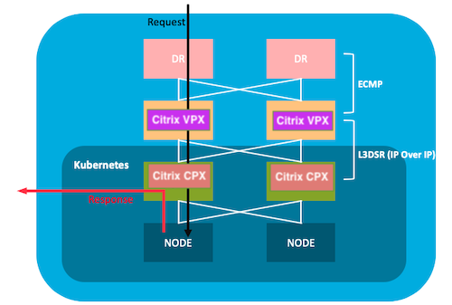

# **DSR**
DSR is an implementation of asymmetric network load distribution in load balanced systems, meaning that the request and response traffic use a different network path.
The use of different network paths helps avoid extra hops and reduces the latency by which not only speeds up the response time between the client and the service but also removes some extra load from the load balancer. Using DSR is a transparent way to achieve increased network performance for your applications with little to no infrastructure changes.

## **Pros**

1. Very fast load-balancing mode
2. Load-balancer network bandwith is not a bottleneck anymore
3. Total output bandwith is the sum of each backend bandwith
4. Less intrusive than the layer 4 load-balancing NAT mode

## **Cons**

1. No layer 7 advanced features are available

## **When use this architecture?**

1. Where response time matters. Example, video streaming.
2. Where no intelligence is required
3. When output capacity of the load-balancer could be the bottleneck

## **Who should read this?**

1. Who wants DSR solution for Kubernetes platform.

## **DSR Network Topology and Traffic Flow**

There is an external Load balancer which distributes the traffic to the Ingress controller on the kubernetes via an overlay (L3 DSR IPIP). Ingress controller picks up the packet , decapsulat it and does actual load balancing amoung service. When return traffic comes from service which will be directly send to the client instead of via ADC.
 


## **1. Tier-2 Configurations.**
- ### **Create a namespace  for DSR.**

	This creates a namespace called ```dsr```.

	```
	kubectl apply -f https://raw.githubusercontent.com/janraj/Networking/master/dsr/KubernetesConfig/dsr_namespace.yaml
	```

- ### **Create a Configmap.**

	```
	kubectl apply -f https://raw.githubusercontent.com/janraj/Networking/master/dsr/KubernetesConfig/cpx_config.yaml -n dsr
	```

- ### **Deploy Citrix CPX ingress controller.**

	Deploy Citrix ADC CPX on namespace ```dsr```.
	```
	kubectl apply -f https://raw.githubusercontent.com/janraj/Networking/master/dsr/KubernetesConfig/citrix-k8s-cpx-ingress.yml -n dsr
	```

## **2. Deploying Application on Kubernetes Cluster**

- ### **Deploy the Guestbook application.**

	```
	  kubectl apply -f https://raw.githubusercontent.com/janraj/Networking/master/dsr/KubernetesConfig/guestbook-all-in-one.yaml -n dsr 
	```
- ### **Expose the guestbook application using ingress.**

	Download the guestbook ingress yaml.
	```
	wget https://raw.githubusercontent.com/janraj/Networking/master/dsr/KubernetesConfig/guestbook-ingress.yaml
	```
	provide the DSR IP/Public IP through which user access your application via ```ingress.citrix.com/frontend-ip:``` annotations.
	```
     	kubectl apply -f guestbook-ingress.yaml -n dsr
	```
## **3. Tier-1 Configurations**
As of now there is no automated configurations avaialbel for Tier-1 ADC. We have to make one time static configurations on Tier-1 ADC.

- ### Configure Virtual Server on ADC.

	Use Virtual Server IP as same as the public IP used in ```ingress.citrix.com/frontend-ip:```. 

	```
	add lb vserver v1 any ******  80 -m iptUNNEL
	add service s1 <cpx-pod-ip> any 80 -usip on
        bind lb vserver v1 s1
	```

## **4. Establish Network connectivity between Tier-1 and Tier-2**
 
Use CNC here.


