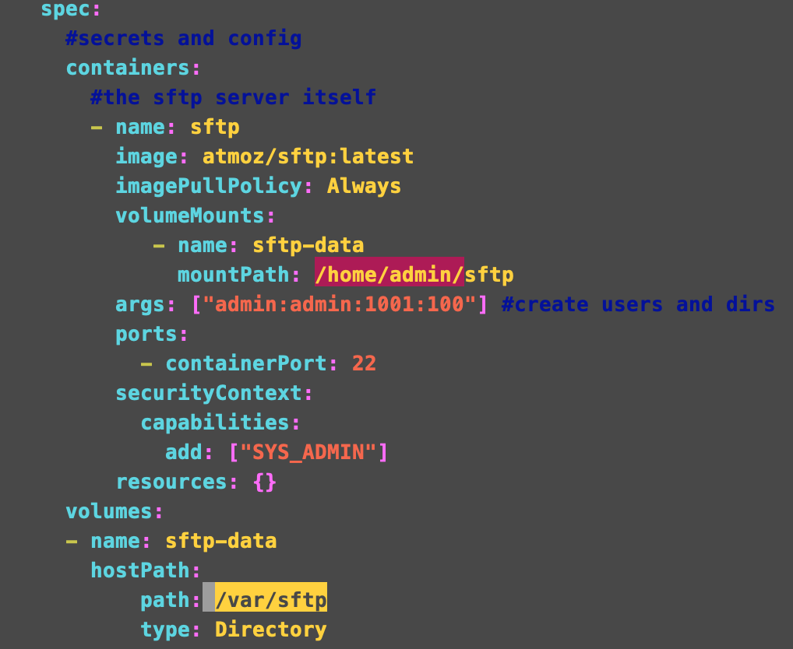
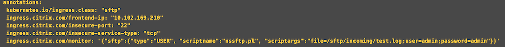
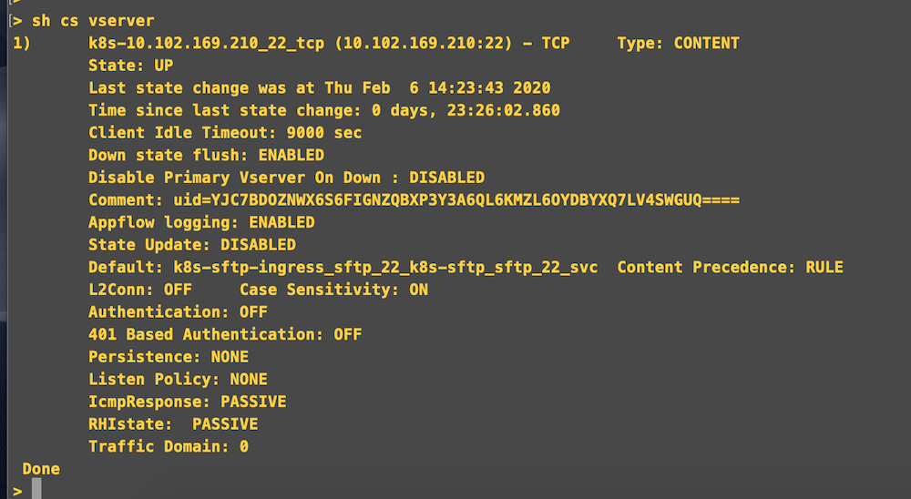
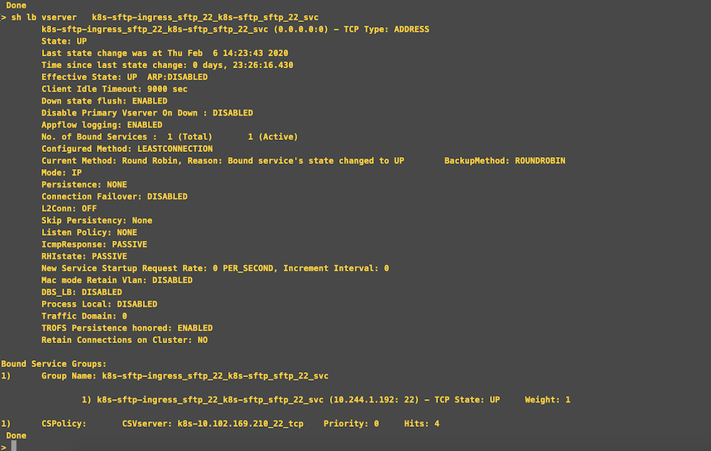
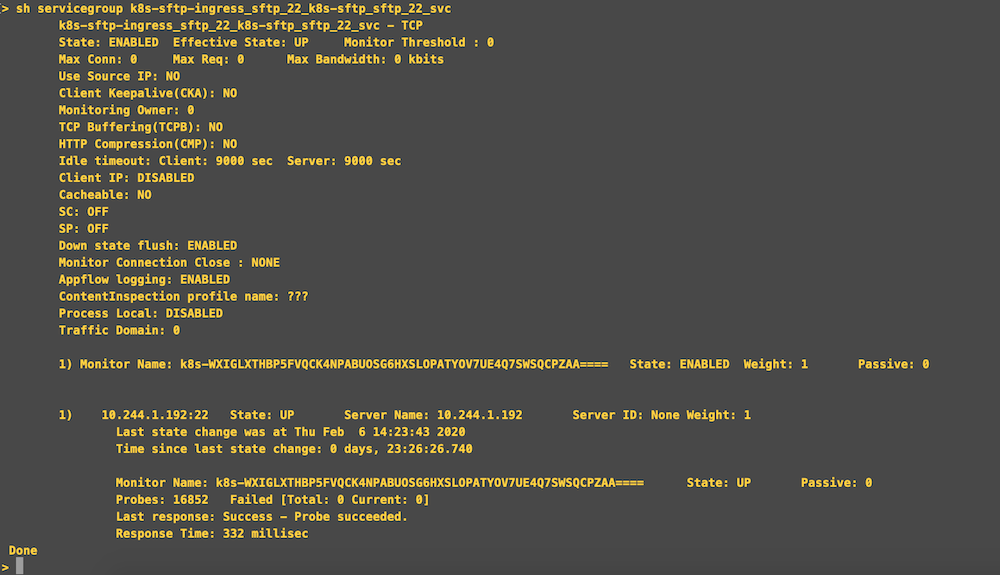
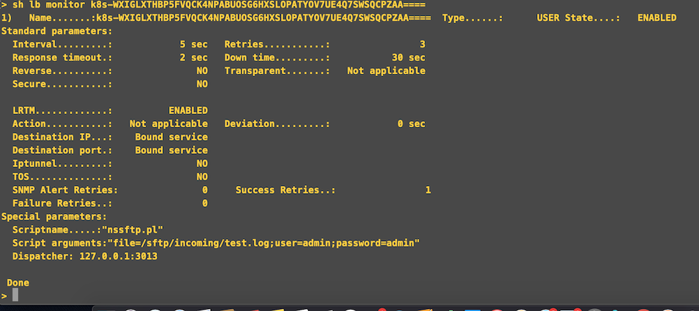
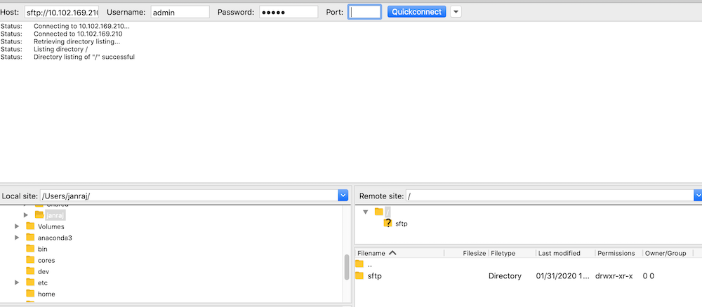

# SFTP Micro Service on Kubernetes 

Secure File Transfer Protocol (SSH File Transfer Protocol) is a network protocol that provides file access, file transfer, and file management over any reliable data stream.Compared to the SCP protocol, which only allows file transfers, the SFTP protocol allows for a range of operations on remote files which make it more like a remote file system protocol. An SFTP client's extra capabilities include resuming interrupted transfers, directory listings, and remote file removal.

## Who should read this?

1. If you want to setup  an SFTP server on a kubernetes and want to expose for pulling the logs or stats of other application logs/data.
2. If you want to see which external load balncer best fit for your sftp application for your kubernetes enviornment.
3. If you want to use SFTP micro service to run on your kubernetes.
4. If you dont know how to setup and share volume mount to your sftp server.
 
## This Section contains

1. Deploy a sftp micro service on a kubernetes cluster  
2. Using Citrix VPX as Ingress Device 
3. Access the sftp application.
4. Verify using VPX stats.
5. Why Citrix ADC is better choice for exposing the SFTP service ?

## Deploy sftp micro service on a kubernetes cluster

As a first setp we are going to dploy the SFTP micro service on kubernetes. Please refer [here](/sftp.yaml) to see the SFTP application yaml.
SFTP yaml contains service and deployment kinds which runs on namespace called ```sftp```. Service is exposed on port 22. Deployment section contains an ```arg``` field which is used for setting up username and password. We can even securly set password for SFTP container by using ```env PASSWORD```.



In this example, highlighed with yellow under host path refers to the volume in your host machine. Highlighed with red refers to the path in the SFTP container. We have to mount host volume to container ```/home/<username>``` location. In this example, in conatiner we use ```/home/admin``` as mount folder because we are using admin as username. 


1. Download the sftp yaml.
   ```
     wget https://raw.githubusercontent.com/janraj/Networking/master/sftp/sftp.yaml
   ```
2. Set username and password.

3. Update directory according to your needs for sharing with SFTP server.

4. Create namespace called ```sftp``` using below command.
   ```
      kubectl create namespace sftp
   ```
4. Deploy the SFTP service.
   ```
     kubectl create -f sftp.yaml -n sftp
   ```

5. Verify sftp service is running

   ``` 
      kubectl get pods -n sftp
   ```
   
   
  

## Use Citrix ADC to expose the SFTP service

Now your sftp micro service is up and running. Next step is to expose this application for users. 
Citrix ADC is being used here to route the traffic to the SFTP service.

1. Create an ingress for the sftp application.
   1. Download the ingress yaml using following command.
      ```
       wget https://raw.githubusercontent.com/janraj/Networking/master/sftp/ingress.yaml
      ```
   2. Citrix Ingress controller uses following annotations to configure the Citrix ADC.
      
      Set the ```ingress.citrix.com/frontend-ip``` with the IP which you want to use for exposing SFTP service.
      Set the username, password and file name on ```ingress.citrix.com/monitor```.
   
   3. Deploy the update ingress using following command.
      ```
      kubectl create -f ingress.yaml -n sftp
      ```
2. Deploy Citrix Ingress controller to configure the Citrix ADC.
     1. Download the citrix ingress controller using
        ```
          wget https://raw.githubusercontent.com/citrix/citrix-k8s-ingress-controller/master/deployment/baremetal/citrix-k8s-ingress-controller.yaml
        ```
     2. Update the enviornment variable follow these [steps](https://github.com/citrix/citrix-k8s-ingress-controller/tree/master/deployment/baremetal).
     3. Update the ingress class for Citrix Ingress controller with ```sftp``` which is being used in ingress. 
     4. Deploy the Citrix ingress controller using
        ```
         kubectl create -f citrix-k8s-ingress-controller.yaml -n sftp
        ```
3. Verify configurations has been created on VPX.
Login to Citrix ADC and check following configurations are created for SFTP applications or not.
   1. Check CS vserver configuration.

      

   2. Check LB vserver configuration.

      

   3. Check Servicegroup configuration.

      

   4. Check Monitor configuration.   

      
    
## Access the SFTP application 

Access the sftp application using the csvserver IP used in the ADC configuration. We can use curl, FileZilla or any such tools.
   


Once  its connected, we can transfer files between local host and server.
   

## Why Citrix ADC is better choice for exposing the SFTP service.

   Citrix ADC allows you to monitor your service at deep level by checking whether the file present in the service or not. This can be easily set using smart annotation provided [here] (https://github.com/citrix/citrix-k8s-ingress-controller/blob/master/docs/configure/annotations.md).
 


  
