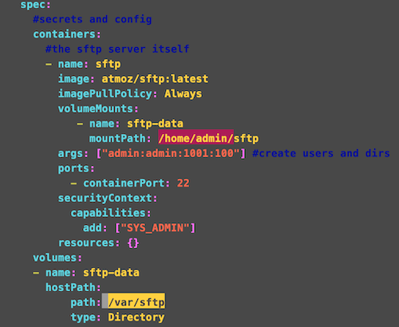

# SFTP Micro Service on Kubernetes 

Secure File Transfer Protocol (SSH File Transfer Protocol) is a network protocol that provides file access, file transfer, and file management over any reliable data stream.Compared to the SCP protocol, which only allows file transfers, the SFTP protocol allows for a range of operations on remote files which make it more like a remote file system protocol. An SFTP client's extra capabilities include resuming interrupted transfers, directory listings, and remote file removal.

## Who should read this?

1. If you want to setup  an SFTP server on a kubernetes and want to expose for pulling the logs or stats of other application logs/data.
2. If you want to see which external load balncer best fit for your sftp application for your kubernetes enviornment.
3. If you want to use SFTP micro service to run on your kubernetes.
4. If you dont know how to setup and share volume mount to your sftp server.
 
## This Section contains

1. Deploy a sftp micro service on a kubernetes cluster  
2. Using Citrix VPX as Ingress Device 
3. Access the sftp application.
4. Verify using VPX stats.
5. Why Citrix ADC is better choice for exposing the SFTP service ?

## Deploy sftp micro service on a kubernetes cluster

As a first setp we are dploying the SFTP micro service on kubernetes. Please refer [here](/sftp.yaml) to see the SFTP application yaml.
### Understand the SFTP Yaml

#### Seeting user and password.

In thsi example we have used args field for setting the username and password. We can even securly set password for SFTP container by using env PASSWORD.

#### Volume Mount


In this example highlighed with yellow under host path refers to the volume in your host machine. Highlighed with red refers to the path in the SFTP container.
Here one point we have to be carefull is the starting location in the SFTP container. In this example mount starts with /home/admin. The user created using args field always kept in home folder of the conatiner. the next field indicate user name.In this case sample user name is being used here is admin hence the volume mount location starts with /home/admin. If user name abc, your mount location starts with /home/abc/.

### Deploy the SFTP yaml

 Download the sftp yaml and set your username, password and volume location and deploy using kubectl command as follows.
### Verify sftp service is running
Please verify the service is running fine by using ``` kubectl get pods -n sftp```


## Use Citrix VPX to expose the SFTP service

   Set up your VPX 
   Deploy an ingress file your sftp service 

## Access the SFTP application 

   Use any of the following to connect to sftp application.
## Verify using VPX stats

## Why Citrix ADC is better choice for exposing the SFTP service.

   It uses a user monitor and probes where the sftp service is avaialbel by pulling the files mentioned in the monitor.


  
